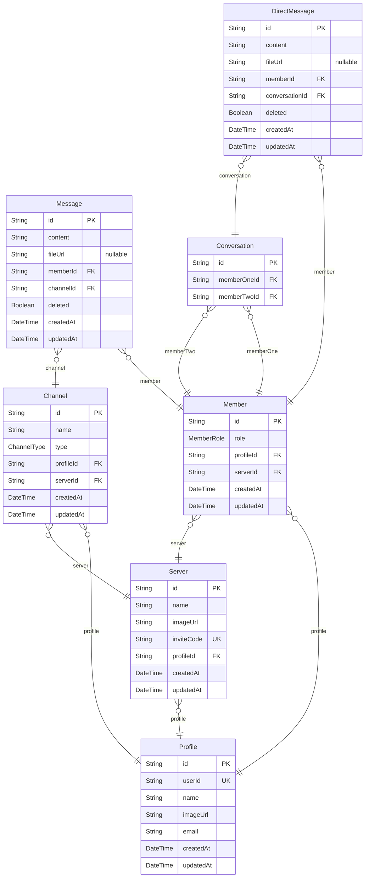

# Intertwine
> Generated by [`prisma-markdown`](https://github.com/samchon/prisma-markdown)

- [default](#default)

## default

### `Profile`

**Properties**
  - `id`: 
  - `userId`: 
  - `name`: 
  - `imageUrl`: 
  - `email`: 
  - `createdAt`: 
  - `updatedAt`: 

### `Server`

**Properties**
  - `id`: 
  - `name`: 
  - `imageUrl`: 
  - `inviteCode`: 
  - `profileId`: 
  - `createdAt`: 
  - `updatedAt`: 

### `Member`

**Properties**
  - `id`: 
  - `role`: 
  - `profileId`: 
  - `serverId`: 
  - `createdAt`: 
  - `updatedAt`: 

### `Channel`

**Properties**
  - `id`: 
  - `name`: 
  - `type`: 
  - `profileId`: 
  - `serverId`: 
  - `createdAt`: 
  - `updatedAt`: 

### `Message`

**Properties**
  - `id`: 
  - `content`: 
  - `fileUrl`: 
  - `memberId`: 
  - `channelId`: 
  - `deleted`: 
  - `createdAt`: 
  - `updatedAt`: 

### `Conversation`

**Properties**
  - `id`: 
  - `memberOneId`: 
  - `memberTwoId`: 

### `DirectMessage`

**Properties**
  - `id`: 
  - `content`: 
  - `fileUrl`: 
  - `memberId`: 
  - `conversationId`: 
  - `deleted`: 
  - `createdAt`: 
  - `updatedAt`: 